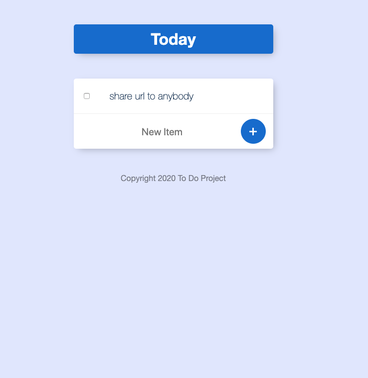

# TO DO List 
To test it, go [there](https://powerful-scrubland-74779.herokuapp.com/)

## What i learn making this app 
- Deploying an app in Heroku.
- Deploying a database in MongoDB Atlas through AWS.
- Using NOSQL database with MongoDB and Mongoose.
- Connecting Client with Server.
- Applying Express.js Framework.
- Play with Npm packages.
- Use Express Route.
- Use EJS to make templates layouts.
- Use EJS views.